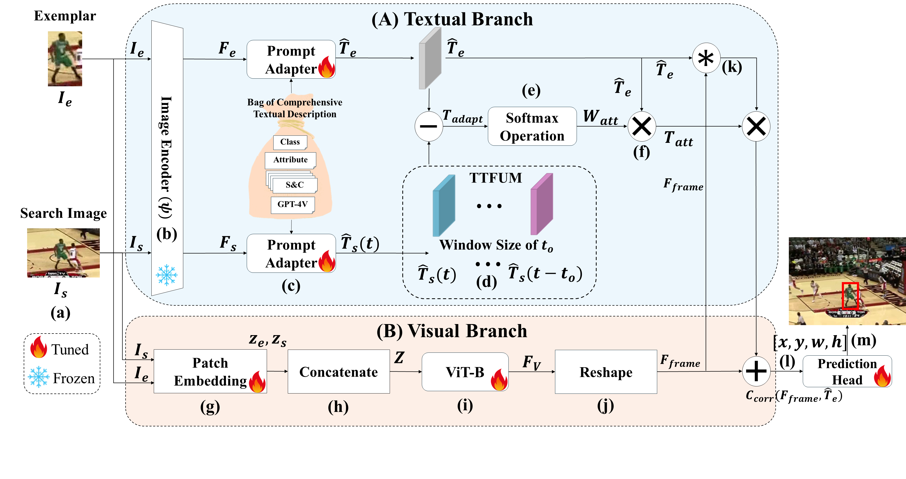
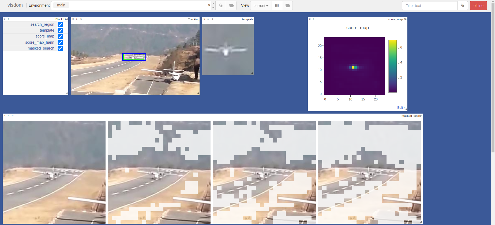

# CLDTracker
The official implementation for the CLDTracker: A Comprehensive Language Description for Visual Tracking.

[[Models](https://drive.google.com/drive/folders/1ttafo0O5S9DXK2PX0YqPvPrQ-HWJjhSy?usp=sharing)][[Raw Results](https://drive.google.com/drive/folders/1TYU5flzZA1ap2SLdzlGRQDbObwMxCiaR?usp=sharing)]
<p align="center">
  
</p>

## Highlights

### :star2: New Comprehensive Language Description for Visual Tracking Tracking Framework
CLDTracker is a simple, high-performance **Vision-Language (VL)** tracker that leverages comprehensive bag of textual descriptions to robustly track.
CLDTracker achieves SOTA performance on multiple benchmarks. CLDTracker and the comprehensive bag of textual descriptions can serve as a strong source for further research.

| Tracker     | LaSOT (AUC) | LaSOT EXT (AUC) | TrackingNet (AUC) | TNL2K (AUC) | OTB99-Lang (AUC) | GOT-10K (AO)|
|:-----------:|:------------:|:-----------:|:-----------------:|:-----------:|:-----------:|:-----------:|
| CLDTracker  | 74.0         | 53.1        | 85.1              | 61.5        | 77.8        | 77.5        |


## Install the environment
**Option1**: Use the Anaconda (CUDA 11.3)
```
conda create -n cldtrack python=3.8.5 -y
conda activate cldtrack
bash install_env.sh
```

**Option2**: Use the Anaconda (CUDA 11.3)
```
conda env create -f cldtrack_env.yaml
```

## Set project paths
Run the following command to set paths for this project
```
python tracking/create_default_local_file.py --workspace_dir . --data_dir ./data --save_dir ./output
```
After running this command, you can also modify paths by editing these two files
```
lib/train/admin/local.py  # paths about training
lib/test/evaluation/local.py  # paths about testing
```

## Data Preparation
Put the tracking datasets in ./data. It should look like this:
   ```
   ${PROJECT_ROOT}
    -- data
        -- lasot
            |-- airplane
            |-- basketball
            |-- bear
            ...
        -- got10k
            |-- test
            |-- train
            |-- val
        -- coco
            |-- annotations
            |-- images
        -- trackingnet
            |-- TRAIN_0
            |-- TRAIN_1
            ...
            |-- TRAIN_11
            |-- TEST
        -- TNL2K
            |-- TRAIN
            |-- TEST
            ...
        -- LaSOText
            |-- atv
            |-- badminton
            ...
        -- OTB99-Lang
            |-- Basketball
            |-- Biker
            |-- Bird1
            ...
   ```

Dataset Download Links:
- [LaSOT](https://github.com/HengLan/LaSOT_Evaluation_Toolkit)
- [LaSOT EXT](https://github.com/HengLan/LaSOT_Evaluation_Toolkit)
- [TNL2K](https://github.com/wangxiao5791509/TNL2K_evaluation_toolkit)
- [TrackingNet](https://github.com/SilvioGiancola/TrackingNet-devkit)
- [GOT-10k](https://github.com/got-10k/toolkit)
- [OTB99-Lang](http://isis-data.science.uva.nl/zhenyang/cvpr17-langtracker/data/OTB_sentences.zip)

## Training
Download pre-trained [MAE ViT-Base weights](https://dl.fbaipublicfiles.com/mae/pretrain/mae_pretrain_vit_base.pth) and put it under `$PROJECT_ROOT$/pretrained_models` (different pretrained models can also be used, see [MAE](https://github.com/facebookresearch/mae) for more details).

```
python tracking/train.py --script cldtrack --config vitb_384_mae_ce_32x4_ep300 --save_dir ./output --mode single --nproc_per_node 1 --use_wandb 0
# or
python tracking/train.py --script cldtrack --config vitb_384_mae_ce_32x4_ep300 --save_dir ./output --mode multiple --nproc_per_node 4 --use_wandb 0
```

Replace `--config` with the desired model config under `experiments/cldtrack`. We use [wandb](https://github.com/wandb/client) to record detailed training logs, in case you don't want to use wandb, set `--use_wandb 0`.


## Evaluation
Download the model weights from [Google Drive](https://drive.google.com/drive/folders/1PS4inLS8bWNCecpYZ0W2fE5-A04DvTcd?usp=sharing) 

Put the downloaded weights on `$PROJECT_ROOT$/output/checkpoints/train/cldtrack`

Change the corresponding values of `lib/test/evaluation/local.py` to the actual benchmark saving paths

Some testing examples:
- LaSOT or other off-line evaluated benchmarks (modify `--dataset` correspondingly)
```
# LaSOT
python tracking/test.py cldtrack vitb_384_mae_ce_32x4_ep300 --dataset lasot --threads 1 --num_gpus 1
python tracking/analysis_results.py # need to modify tracker configs and names

# LaSOText
python tracking/test.py cldtrack vitb_384_mae_ce_32x4_ep300 --dataset lasotextensionsubset --threads 1 --num_gpus 1
python tracking/analysis_results.py # need to modify tracker configs and names

# OTB99-Lang
python tracking/test.py cldtrack vitb_384_mae_ce_32x4_ep300 --dataset otb --threads 1 --num_gpus 1
python tracking/analysis_results.py # need to modify tracker configs and names

# TNL2K
python tracking/test.py cldtrack vitb_384_mae_ce_32x4_ep300 --dataset tnl2k --threads 1 --num_gpus 1
python tracking/analysis_results.py # need to modify tracker configs and names
```
- GOT10K-test
```
python tracking/test.py cldtrack vitb_384_mae_ce_32x4_got10k_ep100 --dataset got10k_test --threads 1 --num_gpus 1
python lib/test/utils/transform_got10k.py --tracker_name cldtrack --cfg_name vitb_384_mae_ce_32x4_got10k_ep100
```
- TrackingNet
```
python tracking/test.py cldtrack vitb_384_mae_ce_32x4_ep300 --dataset trackingnet --threads 1 --num_gpus 1
python lib/test/utils/transform_trackingnet.py --tracker_name cldtrack --cfg_name vitb_384_mae_ce_32x4_ep300
```

## Visualization or Debug 
[Visdom](https://github.com/fossasia/visdom) is used for visualization. 
1. Alive visdom in the server by running `visdom`:

2. Simply type visdom in a terminal and in another terminal set `--debug 1` during inference for visualization, e.g.:
```
# termminal 1
visdom

# terminal 2
python tracking/test.py cldtrack vitb_384_mae_ce_32x4_ep300 --dataset lasot --threads 1 --num_gpus 1 --debug 1
```
3. Open `http://localhost:8097` in your browser (remember to change the IP address and port according to the actual situation).

4. Then you can visualize the candidate elimination process (inherited from OSTrack).




## Test FLOPs, and Speed
*Note:* The speeds reported in our paper were tested on a single GeForce RTX 3080 GPU.

```
# Profiling vitb_384_mae_ce_32x4_ep300
python tracking/profile_model.py --script cldtrack --config vitb_384_mae_ce_32x4_ep300
```


## Acknowledgments
* Thanks for the [OSTrack](https://github.com/botaoye/OSTrack), [CiteTracker](https://github.com/NorahGreen/CiteTracker), [STARK](https://github.com/researchmm/Stark), and [PyTracking](https://github.com/visionml/pytracking) libraries, which helps us to quickly implement our ideas.
* Also we would like to thank [CoCoOp](https://github.com/KaiyangZhou/CoOp/), [WaffleCLIP](https://github.com/ExplainableML/WaffleCLIP), and [CLIP Adapter](https://github.com/gaopengcuhk/CLIP-Adapter).
* We use the implementation of the ViT from the [Timm](https://github.com/rwightman/pytorch-image-models) repo.
* We would like to thank the abovementioned works for their valuable contributions to the field and for sharing their work with the community. Their ideas and code have been instrumental in the development of this project and we are grateful for the opportunity to build upon their work.

## Citation
If our work is useful for your research, please consider citing:

```

```
